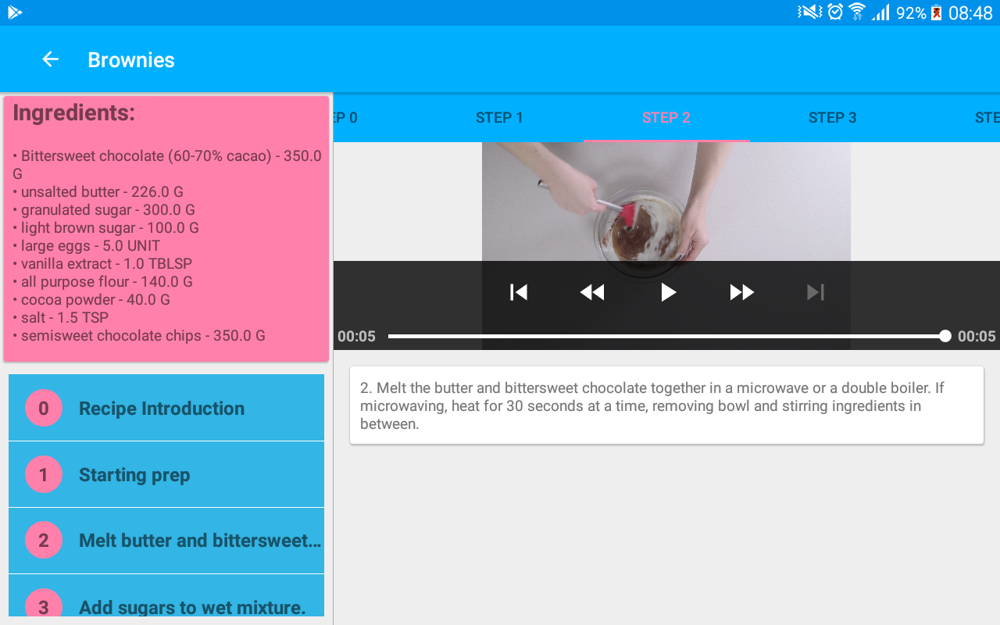

# BakingApp

## About 
Project 4 of Udacity Android Developer Nanodegree. The app takes some recipes in JSON format from the web and shows ingredients, steps, videos.
Thei aim of the app is to learn how to:

- Use MediaPlayer/Exoplayer to display videos.
- Handle error cases in Android.
- Add a widget to your app experience.
- Leverage a third-party library in your app.
- Use Fragments to create a responsive design that works on phones and tablets.

I use Architecture components to create the app:

- MVVM
- Dagger 2
- ViewModel
- Data Binding
- RxJava with Retrofit 2

## Screenshots
   
  
